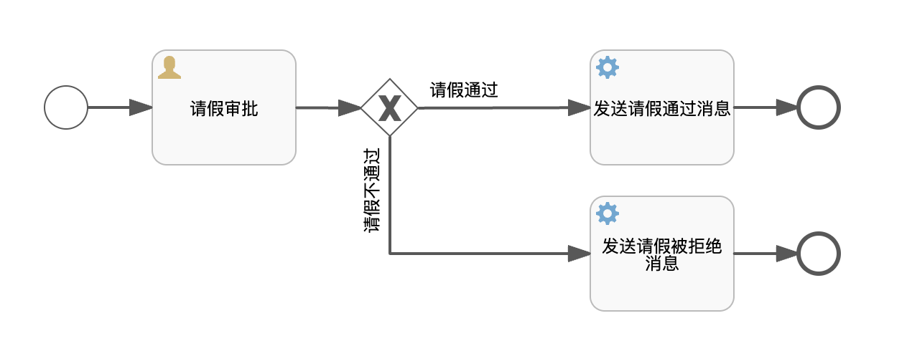

这是一个Flowable的简单流程Demo。
使用的技术包括SpringBoot、SpringSecurity、Vue、Axios、Flowable、MySql、MyBatis等

# 总结

1. runtimeService

# 遇到的大小坑

1. vue3 函数中的this不再指向Vue组件实例。如果需要。可使用如下`*app*.config.globalProperties.$message`这种方式

2. 前后端传输时，JsonFormat无法解析时间格式。model（如果自定义了构造函数，则）必须把默认构造函数写出来。否则

3. `el-table`直接自结束（`<el-table xxx />`）可能会导致数据无法显示

# 绘制流程图



# 用户体系选择

+ 用Flowable的用户体系还是自己的？

> 用自己的。
>
> 1. 思路一：以自己系统中的用户体系为准，根据自己的体系为Flowable创建对应的视图即可。例如Flowable中的`ACT_ID_USER`表可以删除并根据自己系统中的用户表创建一个名为`ACT_ID_USER`视图（数据库查询时并不区分表和视图）。且这个视图的字段和FLowable中原本的字段一致。
> 2. 思路二：利用Flowable中的`IdentityService`去控制Flowable中的用户体系，当我们需要操作自己的用户体系时也顺便操作Flowable中的用户
> 3. 思路三：本Demo使用方法，不保留Flowable的用户体系。

导入用户的脚本，创建了一个role表（内含经理和组长）；创建一个user表（内涵若干用户）；以及user_role表

```sql
DROP TABLE IF EXISTS `role`;

CREATE TABLE `role` (
  `id` int(11) unsigned NOT NULL AUTO_INCREMENT,
  `name` varchar(255) COLLATE utf8mb4_unicode_ci DEFAULT NULL,
  `nameZh` varchar(255) COLLATE utf8mb4_unicode_ci DEFAULT NULL,
  PRIMARY KEY (`id`)
) ENGINE=InnoDB DEFAULT CHARSET=utf8mb4 COLLATE=utf8mb4_unicode_ci;

INSERT INTO `role` (`id`, `name`, `nameZh`)
VALUES
	(1,'manager','经理'),
	(2,'team_leader','组长');

DROP TABLE IF EXISTS `user`;

CREATE TABLE `user` (
  `id` int(11) unsigned NOT NULL AUTO_INCREMENT,
  `username` varchar(255) COLLATE utf8mb4_unicode_ci DEFAULT NULL,
  `password` varchar(255) COLLATE utf8mb4_unicode_ci DEFAULT NULL,
  PRIMARY KEY (`id`)
) ENGINE=InnoDB DEFAULT CHARSET=utf8mb4 COLLATE=utf8mb4_unicode_ci;

INSERT INTO `user` (`id`, `username`, `password`)
VALUES
	(1,'javaboy','{noop}123'),
	(2,'zhangsan','{noop}123'),
	(3,'lisi','{noop}123'),
	(4,'江南一点雨','{noop}123');

DROP TABLE IF EXISTS `user_role`;

CREATE TABLE `user_role` (
  `id` int(11) unsigned NOT NULL AUTO_INCREMENT,
  `uid` int(11) DEFAULT NULL,
  `rid` int(11) DEFAULT NULL,
  PRIMARY KEY (`id`)
) ENGINE=InnoDB DEFAULT CHARSET=utf8mb4 COLLATE=utf8mb4_unicode_ci;
INSERT INTO `user_role` (`id`, `uid`, `rid`)
VALUES
	(1,1,1),
	(2,4,1),
	(3,2,2),
	(4,3,2);
```

# 系统登陆

1. model/User类、model/Role类
2. UserService类（以及配套的mapper）

# 两个服务类

## 请假通过、未通过

`ApproveServiceTask.java`

`RejectServiceTask.java`

+ 完成后把他们的路径引用拷贝到ui画图中的`类`上

# 自动部署

+ 如果运行后没有自动部署，且没有其他错误。删除target文件重新编译运行

# 开启请假流程

主要代码在`AskForLeaveService.java`

+ 注意：关闭Security中得csrf配置，否则Post请求需要携带csrf参数。（这是为了防止攻击，这里就不带了）

# 前后端配置

包括使用CDN 引入 vue3、elementPlus、axios等

# 查看请假流程

1. 查看待审批流程
2. 查看历史

# 查看历史流程

